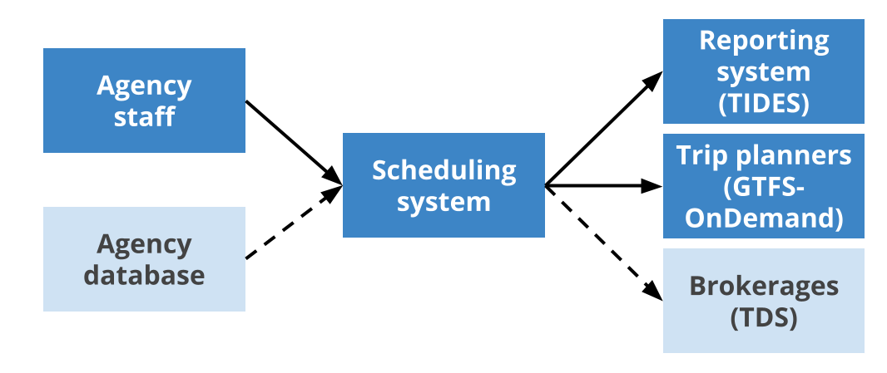
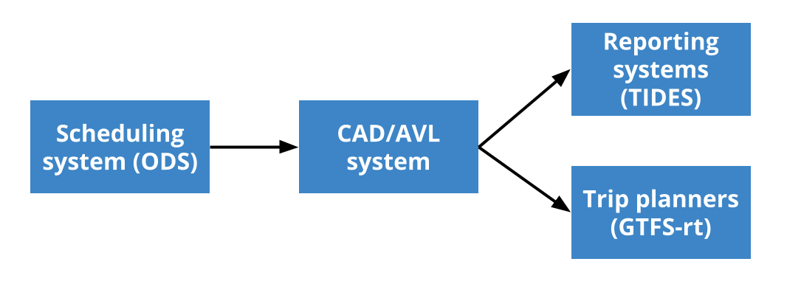
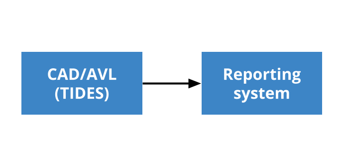

# Interoperable Procurement

This page is a work in progress. Some sections are incomplete.

placeholder for table of contents

The purpose of this document is to document why and how interoperability should be included in any transit technology procurement document and provide example language.

## Why should “Interoperability” be included in procurement?

Interoperability relies on the implementation of certain system requirements and business processes. Unless those requirements and processes are contractually guaranteed, they may not be followed consistently.

### Resources

- The case for interoperability, link needed
- [Getting to interoperability: the Interoperability Logic Model] (https://learn.sharedusemobilitycenter.org/casestudy/mobility-interoperability-logic-model-summary/)

## Where should it be included?
If possible, the word “interoperability” and a reference to the MDIP website, along with specific product-relevant content below should be included in all official procurement documentation, including:
- Requests for information (RFIs)
- Requests for proposals (RFPs)
- Requests for qualifications (RFQs)
- Requests for bids (RFBs)
- Purchase Orders (POs)
- Informal solicitations
- Vendor contracts
- Services contracts 

While interoperability can and should be considered for any technology procurement, the terms below were considered with the following types of technology in mind. 
- Fixed-route and demand-response scheduling software
- Fixed-route and demand-response CAD/AVL systems, including
  - Vehicle location hardware such as GPS devices
  - Mobile Data Terminals (MDT) or other vehicle screens
  - Real-time customer information
- Reporting software

In the future, this document could cover:
- Automated Passenger Counters (APC) on-board hardware and reporting systems
- Passenger trip planning  systems (e.g. trip planners)
- Fare collection systems
- On-board and wayside digital signage 
- Operations software such as:
  - Yard management
  - Train control and signaling
- Bikeshare systems

## How do I include it?

Interoperability should be included in both lists of project objectives and scopes of work where applicable. The suggested statements which implement MDIP in a procurement are described below. A draft contract, scope of work, or terms of service should be published along with any RFP and any vendor exceptions to relevant terms should be noted at the time of proposal.

| Item | Typical location |
| :--- | :--- |
| Overarching project objectives | Contract body or preamble |
| Ownership and Licensing Terms   | Contract body or terms of service |
| Privacy and Cybersecurity Terms | Contract body, terms of service, or privacy policy |
| System requirements for the specific piece of technology being procured | Scope of work or terms of service |
| Definitions, which support the objectives, terms, and requirements | Within each document where defined terms are used |
| Verification of community and cohort feedback | Gathered through reference checks and questions to other mobility agencies |

## Support & Enforcement

Reach out to the Mobility Data Interoperability Principles co-authors with questions, including help with validating and assessing the data exports from your current software systems.

### What is my recourse if they are not being followed?

Notify the MDIP Co-Author coalition with your complaint.  They will help you:
- Identify if there was a loophole in your procurement;
- Identify recourse options, including:
  - Removal of the vendor from the MDIP Co-sponsor list (if applicable)
  - Adding the vendor and the relevant product to a list of “products of concern” with a statement about the reasoning. 
Discuss recourse options with your vendor, including:
- A timeline that they can commit to resolving the problem
- A penalty within this contract if they cannot solve it in the specified time
- A penalty for breaking the mobility data interoperability principles	

## Contract Language

This section includes topics that are generally addressed in the body of a contract.

**Remember: always follow your agency's procurement and contracting policies while incorporating the language below.** If those policies and language below directly conflict, a discussion may be in order to change agency policy.

### Ownership and Licensing

| |
| :--- |
| All data transmitted to the System by the Agency, collected from the Agency by the System, or generated by the System using data provided by the Agency is the property of the Agency with full rights to publish, distribute, and use at their discretion. |
| All data transmitted to the System by the Agency, collected from the Agency by the System, or generated by the System using data provided by the Agency is the property of the Agency with full rights to publish, distribute, and use at their discretion. |

### Privacy and Cybersecurity

| |
| :--- |
| The Contractor shall ensure the security of all Personally Identifiable Information (PII). |
| PII includes but is not limited to the communication with, information provided by, and the movement of individuals or vehicles which are responding to an individual’s needs which could reasonably be associated with them. |
| PII shall be stored in a manner consistent with **{reference your local or state laws regarding data privacy}**.|
| Access to PII shall only be given according to a policy determined by the Transit Provider or via the Transit Provider’s expressed written permission. |
| PII shall follow a data retention policy as set by the Transit Provider. |
| At contract termination, all PII shall be destroyed within 30 days. |

### Additional Recommended Requirements

The following subjects are important considerations when ensuring a successful interoperable technology system. There are not specific requirements that all mobility systems must meet with regard to these subjects, but procuring agencies should take time to define and understand their local needs and vendor offers with regard to:

- Implementation and Configuration
- Training
- Performance Reporting
- Issue Resolution
- Customer Service

### Definitions

Definitions which support the terms used in the procurement language throughout this document can be copied from https://www.interoperablemobility.org/definitions/ which offers a rigorous and regularly updated set of terms as defined by the MDIP co-authors.  Only the terms used in the procurement document need to be defined. 

### System Requirements

System requirements will vary greatly based on the technology components included in the procurement scope.  The general system requirements to support interoperability below should be considered placeholders for more specific requirements based on the technology components included.  Specific requirements can be found below as follows:

- General system requirements
- Fixed-route and demand-response scheduling software
- Fixed-route CAD/AVL systems, including
  - Vehicle location hardware such as GPS devices
  - Mobile Data Terminals (MDT)
  - Real-time customer information
- Reporting software

#### General system requirements

The following system requirements are applicable to most software and hardware systems purchased by mobility agencies.

| |
| :--- |
| Continuous Improvement |
| Updates to the relevant open standards used by the System within the period of performance should result in updates to the system to support the updated open standard within 90 days of its approval including:
- Additions or modifications to the best practices.
- Ability to read and write the updated standard and pass through information in any additional adopted or provisionally adopted/experimental fields.
- Ability to read, write and edit fields pertaining to the schedule within the software.
 |
| Storage |
| The System shall store exported schedule data on the system for the duration of the contract unless it is removed by the client.  Saved data shall be accessible and searchable and available for bulk download. |
| Security |
| The System shall provide the ability to obscure certain data to various users in order to reasonably protect individual privacy. 

The System shall use a secure, account-based authentication system with at least the tiers of privilege and respective capabilities, similar to the following:

- View-only: 
  - View and export data which isn’t privacy-protected
- User: above plus
  - Perform scheduling functions
  - View data which is privacy-protected
  - Export data which isn’t privacy protected
- Manager: above plus
  - Export data which is privacy-protected
- Administrator: above plus
  - Provision manager-level accounts
  - Determine which data fields should be privacy-protected
 |

## Scheduling systems

### Scheduling system description
Scheduling systems exist for both fixed-route and demand-response systems, and while it is possible for a single application to do both this is uncommon. The requirements for each system with respect to the MDIP should be defined separately.

Fixed-route scheduling system functions:
- Define and publish fixed route schedules in GTFS format and for use in agency CAD/AVL systems
- Manage assignment of vehicles and drivers
- Optionally, importing information from agency databases for these purposes

Demand-response scheduling system functions include the following:
- Define and publish scheduled trips for demand-response riders in GTFS-OnDemand format
- Track the performance of scheduled trips
- Manage assignment of vehicles and drivers
- Optionally, importing information from agency databases for these purposes

Note that there is often no CAD/AVL system separate from the demand-response software system other than the AVL hardware, unlike fixed route transit service where these two systems are often separated.

### Fixed-route scheduling system requirements
Fixed-route scheduling systems should meet the following requirements to be considered compliant with the MDIP.

| |
| :--- |
| Input/Output |
| The scheduling system shall receive, process, store, and export customer-generated data and derived data, free from additional costs or restrictions. 

The scheduling system shall receive, store, provide access to, and make available via an appropriate API, data in the most recent version of the following open standards including their best practices:
- Rider-facing schedule data in GTFS Schedule; and
- As-operated data in the Operational Data Standard (ODS). 

Best practices shall be defined as both should statements in the standard itself as well as official best practices documents such as the [GTFS Schedule Best Practices](https://gtfs.org/schedule/best-practices/).

The scheduling system shall be enabled to receive the following inputs both through an ad-hoc import or by fetching using an API. 
- Driver/operator rosters and associated data necessary to assign drivers/operators to runs in a Well-documented Data Format.
- Vehicle inventory and associated data necessary to assign vehicles to blocks in a Well-documented Data Format. 

Input data schemas and APIs shall be consistent with any other relevant open standards
 |
| Built-in Enforcement + Monitoring |
| The scheduling system shall include a mechanism to ensure that exported data is consistent with the above requirements using relevant canonical validators.  Data which would not pass the above requirements using relevant canonical validators shall require an explicit override to export.  Validation reports for each export shall be transparent to the customer and provide a course of action to remedy.

Validation errors which are the result of scheduling software errors and cannot be remedied by the customer shall be automatically reported to Customer and Contractor and are subject to Performance Minimums and Recovery Time Objectives. 
 |
 
Demand-response scheduling systems should meet the following requirements to be considered compliant with the MDIP.

| |
| :--- |
| Input/Output |
| The scheduling system shall receive, process, store, and export the following data in the most recent version of the following open standards:
- Near real-time service parameters in GTFS-OnDemand;
- As-operated data in the TIDES data suite.
- Passenger data in the TIDES data suite or GTFS-Ride.
These features shall be free from additional costs or restrictions, other than reasonable restrictions on real-time data downloads.

The scheduling system shall provide public access to the following data streams:
- GTFS-Realtime OnDemand.

The scheduling system shall be enabled to receive the following inputs both through an ad-hoc import or by fetching using an API. 
- Driver/operator rosters and associated data necessary to assign drivers/operators to runs in a Well-documented Data Format.
- Vehicle inventory and associated data necessary to assign vehicles to blocks in a Well-documented Data Format.
 |

## CAD/AVL Systems

### CAD/AVL System Description
Computer-aided Dispatch and Automatic Vehicle Location (“CAD/AVL”) systems are commonly marketed separate from scheduling systems for fixed-route systems.

Fixed route CAD/AVL system functions:
- Import schedule and operational data on to vehicle hardware
- Monitor vehicle adherence to schedules and provide dispatch system capabilities
- Output real-time information regarding the status of the transit system
- Optionally, control various downstream onboard or offboard systems

### CAD/AVL system requirements
Fixed-route CAD/AVL systems should meet the following requirements to be considered compliant with the MDIP.

| |
| :--- |
| The CAD/AVL system shall import, store and export access to the following data in the most recent version of the following open standards:
Schedule data in the Operational Data Standard or GTFS-Schedule;
- As-operated data in the TIDES data suite; 
- Passenger data in the TIDES data suite or GTFS-Ride; 
- Real-time data on system performance in GTFS-Realtime.
- These features shall be free from additional costs or restrictions, other than reasonable restrictions on real-time data downloads.

Updates to the open standards documented above within the period of performance should result in updates to the CAD/AVL system to support the updated open standard within 30 days of its approval. 

The CAD/AVL system shall provide public access to the following data streams:
- GTFS-Realtime Vehicle Positions; 
- GTFS-Realtime Trip Updates; and
- GTFS-Realtime Alerts.

 |
 
## Reporting systems

### Reporting system description

Reporting systems aggregate transit network performance data and visualize and analyze that data. 

Reporting system functions:
- Import schedule and performance data
- Calculate and display relevant performance statistics

### Reporting system requirements
Reporting systems should meet the following requirements to be considered compliant with the MDIP.

| |
| :--- |
| The reporting system shall import and store the following data in the most recent version of the following open standards:
Schedule data in the Operational Data Standard or GTFS-Schedule;
- As-operated data in the TIDES data suite; 
- Passenger data in the TIDES data suite or GTFS-Ride; 
- Real-time data on system performance in GTFS-Realtime.

 |

--8<-- "includes/glossary.md"
